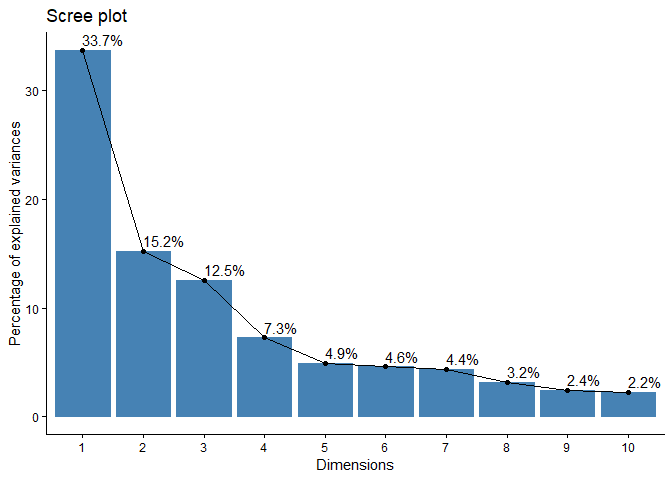
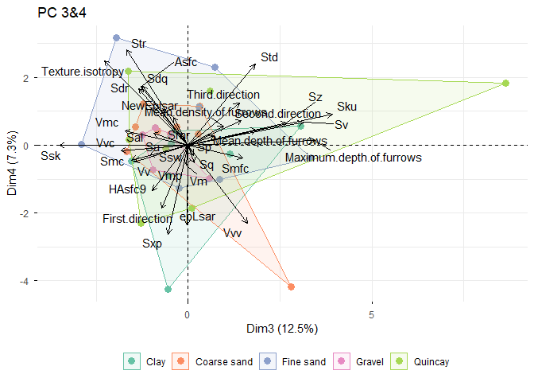
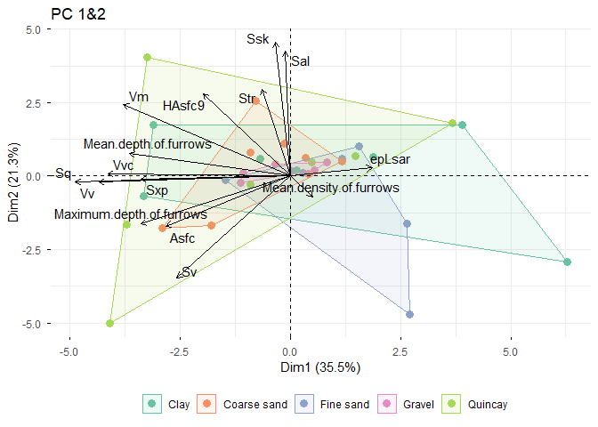
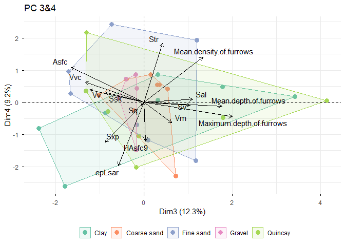

Plots for the the Freeze-thaw project
================
Ivan Calandra
2025-11-26 14:11:47 CET

- [Goal of the script](#goal-of-the-script)
- [Load packages](#load-packages)
- [Read in data](#read-in-data)
- [Format data](#format-data)
  - [Exclude NMP, and combine Specimen and Location in one
    column](#exclude-nmp-and-combine-specimen-and-location-in-one-column)
  - [Create new datasets based on
    NMP_cat](#create-new-datasets-based-on-nmp_cat)
  - [Calculate the mean per specimen per
    cycle](#calculate-the-mean-per-specimen-per-cycle)
  - [Add units to headers for
    plotting](#add-units-to-headers-for-plotting)
- [Line plots for height maps with \<17%
  NMP](#line-plots-for-height-maps-with-17-nmp)
  - [Create list to receive the
    plots](#create-list-to-receive-the-plots)
  - [Plots](#plots)
  - [Save plots](#save-plots)
- [PCA for height maps with \<17% NMP](#pca-for-height-maps-with-17-nmp)
  - [Format data](#format-data-1)
  - [Custom plotting function](#custom-plotting-function)
  - [Run PCA with all parameters](#run-pca-with-all-parameters)
  - [PCA on selected parameters](#pca-on-selected-parameters)
    - [Select surface texture
      parameters](#select-surface-texture-parameters)
    - [PCA](#pca)
    - [Plots](#plots-1)
      - [Eigenvalues](#eigenvalues)
      - [Biplots](#biplots)
      - [Combine plots to save them into 1
        file](#combine-plots-to-save-them-into-1-file)
      - [Save plots](#save-plots-1)
- [Line plots for height maps with \<10%
  NMP](#line-plots-for-height-maps-with-10-nmp)
- [PCA for height maps with \<10% NMP](#pca-for-height-maps-with-10-nmp)
- [sessionInfo()](#sessioninfo)
- [Cite R packages used](#cite-r-packages-used)
  - [References](#references)

------------------------------------------------------------------------

# Goal of the script

The script plots all STA variables for the Freeze-thaw dataset.

``` r
dir_in  <- "analysis/derived_data"
dir_plots <- "analysis/plots"
```

Input Rbin data file must be located in “./analysis/derived_data”.  
Plots will be saved in “./analysis/plots”.

The knit directory for this script is the project directory.

------------------------------------------------------------------------

# Load packages

``` r
library(doBy)
library(factoextra)
library(ggplot2)
library(grateful)
library(knitr)
library(patchwork)
library(R.utils)
library(RColorBrewer)
library(rmarkdown)
library(tidyverse)
```

------------------------------------------------------------------------

# Read in data

``` r
FT_file <- list.files(dir_in, pattern = ".*STA.*\\.Rbin$", full.names = TRUE)
FT <- loadObject(FT_file)
```

The following data file has been read:
“analysis/derived_data/FT_STA_formatted-data.Rbin”

Below are its structure and first lines:

``` r
str(FT)
```

    'data.frame':   80 obs. of  41 variables:
     $ Specimen                : chr  "Scra11" "Scra11" "Scra11" "Scra11" ...
     $ Sediment                : chr  "Quincay" "Quincay" "Quincay" "Quincay" ...
     $ Cycles                  : num  600 600 600 600 0 0 0 0 330 330 ...
     $ State                   : Factor w/ 2 levels "before","after": 2 2 2 2 1 1 1 1 2 2 ...
     $ Location                : chr  "loc1" "loc2" "loc3" "loc4" ...
     $ NMP                     : num  6.21 8.99 9.36 7.09 5.59 ...
     $ NMP_cat                 : Ord.factor w/ 3 levels "<10%"<"10-17%"<..: 1 1 1 1 1 1 1 1 2 2 ...
     $ Sq                      : num  510 599 627 536 461 ...
     $ Ssk                     : num  0.208 0.104 -1.349 0.307 0.364 ...
     $ Sku                     : num  3.61 4.28 16.22 3.5 3.44 ...
     $ Sp                      : num  2002 2280 4021 2237 1940 ...
     $ Sv                      : num  1895 2130 4888 1622 1193 ...
     $ Sz                      : num  3898 4410 8910 3859 3134 ...
     $ Sa                      : num  395 444 400 421 362 ...
     $ Smr                     : num  3.359 2.643 0.138 1.933 3.147 ...
     $ Smc                     : num  631 705 594 670 568 ...
     $ Sxp                     : num  959 1299 1119 961 834 ...
     $ Sal                     : num  5.54 6.57 5.66 5.69 6.11 ...
     $ Str                     : num  0.757 0.697 0.611 0.648 0.681 ...
     $ Std                     : num  54.7 74.7 85.5 57.8 86.3 ...
     $ Ssw                     : num  0.425 0.425 0.425 0.425 0.425 ...
     $ Sdq                     : num  0.594 0.319 0.372 0.324 0.318 ...
     $ Sdr                     : num  14.11 4.67 5.96 4.85 4.7 ...
     $ Vm                      : num  0.0322 0.0418 0.0411 0.0331 0.0301 ...
     $ Vv                      : num  0.663 0.747 0.635 0.703 0.598 ...
     $ Vmp                     : num  0.0322 0.0418 0.0411 0.0331 0.0301 ...
     $ Vmc                     : num  0.43 0.452 0.381 0.467 0.401 ...
     $ Vvc                     : num  0.606 0.667 0.547 0.649 0.551 ...
     $ Vvv                     : num  0.0574 0.0803 0.0885 0.054 0.0469 ...
     $ First.direction         : num  45 90 90 45 90 ...
     $ Second.direction        : num  0.0108 179.9952 44.9961 90.0142 135.0262 ...
     $ Third.direction         : num  90 135 116 135 180 ...
     $ Texture.isotropy        : num  82.4 68.8 58.8 71.8 72.2 ...
     $ Maximum.depth.of.furrows: num  3418 4350 9462 3943 3052 ...
     $ Mean.depth.of.furrows   : num  1714 1899 3460 1857 1528 ...
     $ Mean.density.of.furrows : num  6492 6945 7121 6632 6748 ...
     $ epLsar                  : num  0.000586 0.002807 0.001736 0.002383 0.002474 ...
     $ NewEplsar               : num  0.0175 0.0168 0.0179 0.0167 0.0169 ...
     $ Asfc                    : num  49.9 13.8 19.8 13.1 13.1 ...
     $ Smfc                    : num  1.081 1.153 1.495 1.153 0.949 ...
     $ HAsfc9                  : num  0.133 0.444 0.949 0.314 0.177 ...
     - attr(*, "comment")= Named chr [1:35] "%" "nm" "<no unit>" "<no unit>" ...
      ..- attr(*, "names")= chr [1:35] "NMP" "Sq" "Ssk" "Sku" ...

``` r
head(FT)
```

      Specimen Sediment Cycles  State Location      NMP NMP_cat       Sq        Ssk
    1   Scra11  Quincay    600  after     loc1 6.210140    <10% 510.3147  0.2082995
    2   Scra11  Quincay    600  after     loc2 8.988605    <10% 599.4221  0.1038576
    3   Scra11  Quincay    600  after     loc3 9.360195    <10% 626.8703 -1.3491279
    4   Scra11  Quincay    600  after     loc4 7.087054    <10% 535.8293  0.3066295
    5   Scra11  Quincay      0 before     loc1 5.585075    <10% 461.3625  0.3644242
    6   Scra11  Quincay      0 before     loc2 7.824051    <10% 537.4528 -0.3339857
            Sku       Sp       Sv       Sz       Sa       Smr      Smc       Sxp
    1  3.611167 2002.269 1895.237 3897.506 395.2242 3.3585136 630.9984  959.4634
    2  4.277262 2280.247 2129.979 4410.227 444.2419 2.6425792 705.0265 1299.1056
    3 16.215072 4021.251 4888.391 8909.643 399.6521 0.1384577 594.0357 1118.6396
    4  3.504882 2236.933 1622.238 3859.171 420.7068 1.9326553 670.0448  961.0071
    5  3.438282 1940.378 1193.170 3133.549 362.0558 3.1472606 568.2292  834.1125
    6  4.060290 1796.531 2537.250 4333.781 412.1910 6.2930831 674.2111 1111.3785
           Sal       Str      Std       Ssw       Sdq       Sdr         Vm
    1 5.535718 0.7571265 54.74853 0.4249085 0.5937326 14.108213 0.03220712
    2 6.570978 0.6973378 74.74841 0.4249085 0.3186908  4.665525 0.04181877
    3 5.662375 0.6112438 85.50156 0.4249085 0.3722057  5.960471 0.04105984
    4 5.693638 0.6484318 57.75130 0.4249085 0.3241989  4.854970 0.03305849
    5 6.107537 0.6810785 86.25058 0.4249085 0.3179695  4.701684 0.03014862
    6 5.961985 0.6743632 86.99719 0.4249085 0.4060171  7.404031 0.02403996
             Vv        Vmp       Vmc       Vvc        Vvv First.direction
    1 0.6632383 0.03220712 0.4298770 0.6058456 0.05739273        44.99067
    2 0.7468693 0.04181877 0.4518377 0.6665194 0.08034989        89.99559
    3 0.6350726 0.04105984 0.3806123 0.5465987 0.08847389        90.00050
    4 0.7030889 0.03305849 0.4670876 0.6490426 0.05404634        44.98490
    5 0.5983675 0.03014862 0.4005538 0.5514198 0.04694766        89.99058
    6 0.6982755 0.02403996 0.4565223 0.6277425 0.07053295        45.01407
      Second.direction Third.direction Texture.isotropy Maximum.depth.of.furrows
    1       0.01081937        90.00509         82.36371                 3418.379
    2     179.99523860       134.98878         68.76672                 4350.215
    3      44.99608453       116.43945         58.82372                 9461.823
    4      90.01423227       135.00686         71.81574                 3943.282
    5     135.02619380       179.99602         72.18861                 3051.558
    6      89.99811744        63.56398         57.93184                 4003.873
      Mean.depth.of.furrows Mean.density.of.furrows       epLsar  NewEplsar
    1              1714.284                6492.159 0.0005855797 0.01748435
    2              1899.377                6945.496 0.0028073607 0.01681894
    3              3459.689                7121.221 0.0017361474 0.01787320
    4              1857.354                6632.412 0.0023834012 0.01666934
    5              1527.908                6748.034 0.0024736287 0.01686902
    6              1607.176                7054.717 0.0012932325 0.01710849
          Asfc      Smfc    HAsfc9
    1 49.92666 1.0805865 0.1333228
    2 13.83172 1.1530754 0.4437028
    3 19.82069 1.4950314 0.9494297
    4 13.06050 1.1530754 0.3135672
    5 13.10260 0.9489935 0.1773680
    6 26.90327 0.8893344 0.2908531

------------------------------------------------------------------------

# Format data

## Exclude NMP, and combine Specimen and Location in one column

``` r
# Exclude NMP
FT <- select(FT, !NMP)  %>% 
  
      # Combine Specimen and Location in one column
      # Necessary to connect points when plotting individual points
      mutate(SpecLoc = paste(Specimen, Location, sep = "-"))
```

## Create new datasets based on NMP_cat

``` r
# Select all rows with NMP_cat ≤ 10% 
FT_NMP10 <- filter(FT, NMP_cat == "<10%")

# Select all rows with NMP_cat ≤ 10% or 10-17%
FT_NMP17 <- filter(FT, NMP_cat %in% c("<10%", "10-17%"))
```

When considering only height maps with 10% NMP or less, 45 height maps
are excluded and 35 are kept for further analysis.  
When considering only height maps with 17% NMP or less, 8 height maps
are excluded and 72 are kept for further analysis.

## Calculate the mean per specimen per cycle

``` r
# Calculate means based on Specimen + Cycles
# Sediment is listed as factor in order to keep this column
# keep.names = TRUE is important for the matching on names in the plots
FT_NMP10_mean <- summaryBy(.~ Specimen + Sediment + Cycles, data = FT_NMP10,
                           FUN = mean, keep.names = TRUE)
FT_NMP17_mean <- summaryBy(.~ Specimen + Sediment + Cycles, data = FT_NMP17,
                           FUN = mean, keep.names = TRUE)
```

## Add units to headers for plotting

This cannot be done before on `FT` because it create problems during the
calculations of the means due to the column names with spaces and
special characters (for units).  
Also, for `FT_NMP10` and `FT_NMP17`, a copy is created here because such
column names are also problematic for the PCA (see below).

``` r
# Get units from comment(FT)
table_units <- comment(FT) %>% 
               data.frame(Parameter = names(.), Unit = ., row.names = NULL) %>% 
  
               # Exclude NMP because it won't be plotted
               filter(Parameter != "NMP") %>% 
  
               # Paste parameter name and unit together in a new column
               mutate(Param_unit = paste0(Parameter, " [", Unit, "]")) 

# Remove > and < symbols
table_units$Param_unit <- gsub(">|<", "", table_units$Param_unit)

# Create copies of FT_NMP10 and FT_NMP17
FT_NMP10_units <- FT_NMP10
FT_NMP17_units <- FT_NMP17

# Adjust column names
colnames(FT_NMP10_units)[colnames(FT_NMP10_units) %in% table_units$Parameter] <- table_units$Param_unit
colnames(FT_NMP17_units)[colnames(FT_NMP17_units) %in% table_units$Parameter] <- table_units$Param_unit
colnames(FT_NMP10_mean)[colnames(FT_NMP10_mean) %in% table_units$Parameter] <- table_units$Param_unit
colnames(FT_NMP17_mean)[colnames(FT_NMP17_mean) %in% table_units$Parameter] <- table_units$Param_unit
```

These are the new column names for the plots:

    Sq [nm]
    Ssk [no unit]
    Sku [no unit]
    Sp [nm]
    Sv [nm]
    Sz [nm]
    Sa [nm]
    Smr [%]
    Smc [nm]
    Sxp [nm]
    Sal [µm]
    Str [no unit]
    Std [°]
    Ssw [µm]
    Sdq [no unit]
    Sdr [%]
    Vm [µm³/µm²]
    Vv [µm³/µm²]
    Vmp [µm³/µm²]
    Vmc [µm³/µm²]
    Vvc [µm³/µm²]
    Vvv [µm³/µm²]
    First.direction [°]
    Second.direction [°]
    Third.direction [°]
    Texture.isotropy [%]
    Maximum.depth.of.furrows [nm]
    Mean.depth.of.furrows [nm]
    Mean.density.of.furrows [cm/cm2]
    epLsar [no unit]
    NewEplsar [no unit]
    Asfc [no unit]
    Smfc [µm²]
    HAsfc9 [no unit]

------------------------------------------------------------------------

# Line plots for height maps with \<17% NMP

## Create list to receive the plots

``` r
p_line_NMP17 <- vector(mode = "list", length = nrow(table_units))
names(p_line_NMP17) <- table_units$Param_unit
```

## Plots

``` r
# Design for patchwork combination of plots (see below)
design_patch <- c(area(1, 1, 2, 3), area(3, 1, 3, 1), area(3, 2, 3, 2))

# Plot for every parameters
for (i in names(p_line_NMP17)) {
  
  # Define y-axis limits based on the range of the y-variable
  # This ensures that both plots have the same y-range
  #range_y <- range(FT_NMP17_units[[i]])
  
  # Plot of individual data points
             #  Define aesthetics 
  p_indiv <- ggplot(data = FT_NMP17_units, aes(x = Cycles, y = .data[[i]], color = Sediment)) + 
             
             # Add points
             geom_point(size = 3) + 
     
             # Facet plot by 'Sediment'
             facet_wrap(~ Sediment) +
    
             # Add lines to connect points with identical "SpecLoc"
             geom_line(linewidth = 0.5, aes(group = SpecLoc), show.legend = FALSE) +
    
             # Light theme
             theme_classic() +
     
             # Set2 "may be a problem for some, but not all folks with color vision impairment".
             # However, there is no colorblind safe qualitative set with 5 data classes.
             scale_color_brewer(palette = 'Set2') +
    
             # Set y-limits
             #ylim(range_y[1], range_y[2]) +
    
             # Add title to plot
             labs(title = "Individual data points")

  # Plot of means per sample and cycle
  p_mean <- ggplot(data = FT_NMP17_mean, aes(x = Cycles, y = .data[[i]], color = Sediment)) + 
            geom_point(size = 3) + 
            geom_line(linewidth = 0.5, aes(group = Specimen), show.legend = FALSE) +
            theme_classic() +
            scale_color_brewer(palette = 'Set2') +
            #ylim(range_y[1], range_y[2]) +
            labs(title = "Mean per sample and cycle")

  # Combine both plots with patchwork
  p_line_NMP17[[i]] <- p_indiv / p_mean + guide_area() + 
                       plot_layout(guides = 'collect', design = design_patch)
}

# Print all plots
print(p_line_NMP17)
```

    $`Sq [nm]`

<!-- -->


    $`Ssk [no unit]`

<!-- -->


    $`Sku [no unit]`

<!-- -->


    $`Sp [nm]`

<!-- -->


    $`Sv [nm]`

<!-- -->


    $`Sz [nm]`

<!-- -->


    $`Sa [nm]`

<!-- -->


    $`Smr [%]`

<!-- -->


    $`Smc [nm]`

<!-- -->


    $`Sxp [nm]`

<!-- -->


    $`Sal [µm]`

<!-- -->


    $`Str [no unit]`

<!-- -->


    $`Std [°]`

<!-- -->


    $`Ssw [µm]`

<!-- -->


    $`Sdq [no unit]`

<!-- -->


    $`Sdr [%]`

<!-- -->


    $`Vm [µm³/µm²]`

<!-- -->


    $`Vv [µm³/µm²]`

<!-- -->


    $`Vmp [µm³/µm²]`

<!-- -->


    $`Vmc [µm³/µm²]`

<!-- -->


    $`Vvc [µm³/µm²]`

<!-- -->


    $`Vvv [µm³/µm²]`

<!-- -->


    $`First.direction [°]`

<!-- -->


    $`Second.direction [°]`

<!-- -->


    $`Third.direction [°]`

<!-- -->


    $`Texture.isotropy [%]`

<!-- -->


    $`Maximum.depth.of.furrows [nm]`

<!-- -->


    $`Mean.depth.of.furrows [nm]`

<!-- -->


    $`Mean.density.of.furrows [cm/cm2]`

<!-- -->


    $`epLsar [no unit]`

<!-- -->


    $`NewEplsar [no unit]`

<!-- -->


    $`Asfc [no unit]`

<!-- -->


    $`Smfc [µm²]`

<!-- -->


    $`HAsfc9 [no unit]`

<!-- -->

## Save plots

``` r
ggsave(filename = "FT_STA-plots_NMP17.pdf", path = dir_plots, plot = p_line_NMP17, 
       width = 190, height = 200, units = "mm")
```

------------------------------------------------------------------------

# PCA for height maps with \<17% NMP

## Format data

PCA will be applied to the differences between after and before the
experiments, for all surface texture parameter.

The method below works only with 2 values per group, which is the case
here.

``` r
# Create function to subtract the 1st value from the 2nd value of a vector
# Returns NA if at least one value is NA
fun_minus <- function(x) {
  x[2] - x[1]
}

# Calculate the difference between after and before
                     # Exclude Cycles
FT_NMP17_pca_data <- select(FT_NMP17, !c(Cycles, NMP_cat)) %>% 
  
                     # Arrange to make sure that the difference is calculated with the correct values 
                     # in the correct order
                     arrange(Specimen, Location, State) %>% 
  
                     # Group by Specimen, Sediment and Location (= everything except State)
                     group_by(Specimen, Sediment, Location) %>%
  
                     # Apply function fun_minus to each group
                     summarize(across(where(is.numeric), fun_minus)) %>% 
  
                     # Remove rows with NA
                     na.omit() 
```

## Custom plotting function

The library `factoextra` is not maintained anymore so there are some
warnings due to issues with newer versions of ggplot2.

``` r
custom_pca_biplot <- function(dat, datpca, pc = c(1, 2), geom.pt = "point", col.pt, mean.pt = FALSE, 
                              col.pal = brewer.pal(length(unique(datpca[[col.pt]])), "Set2"), 
                              pt.size = 3, pt.shape = 19, pt.fill = "white",
                              elli = TRUE, elli.type = "convex", repel.lab = TRUE, 
                              col.variable = "black", main.title){
  
  # Define plotting
  p_out <- fviz_pca_biplot(dat, axes = pc, 
                           geom.ind = geom.pt, col.ind = datpca[[col.pt]], mean.point = mean.pt,
                           palette = col.pal, pointsize = pt.size, pointshape = pt.shape, fill.ind = pt.fill,
                           addEllipses = elli, ellipse.type = elli.type,  
                           repel = repel.lab, col.var = col.variable, title = main.title, legend.title = "")
  
  p_out <- p_out + theme(legend.position = "bottom")

  # Return plotting object
  return(p_out)
}
```

## Run PCA with all parameters

This PCA is only meant to select the most informative parameters.  
For comments on the code, see section [PCA on selected
parameters](#pca-on-selected-parameters).

``` r
pca_FT_NMP17_all <- prcomp(FT_NMP17_pca_data[4:37], scale. = TRUE)

pca_FT_NMP17_all_eig <- fviz_eig(pca_FT_NMP17_all, addlabels = TRUE, ggtheme = theme_classic())
```

    Warning in geom_bar(stat = "identity", fill = barfill, color = barcolor, :
    Ignoring empty aesthetic: `width`.

``` r
print(pca_FT_NMP17_all_eig)
```

<!-- -->

``` r
grp_PCA <- "Sediment"
pca_FT_NMP17_all_12 <- custom_pca_biplot(pca_FT_NMP17_all, datpca = FT_NMP17_pca_data, pc = c(1, 2), 
                                         col.pt = grp_PCA, main.title = "PC 1&2")
print(pca_FT_NMP17_all_12)
```

<!-- -->

``` r
pca_FT_NMP17_all_34 <- custom_pca_biplot(pca_FT_NMP17_all, datpca = FT_NMP17_pca_data, pc = c(3, 4), 
                                         col.pt = grp_PCA, main.title = "PC 3&4")
print(pca_FT_NMP17_all_34)
```

<!-- -->

``` r
all_plots_all <- list(pca_FT_NMP17_all_eig, pca_FT_NMP17_all_12, pca_FT_NMP17_all_34)  
ggsave(filename = "FT_PCA-plots_NMP17_all-params.pdf", path = dir_plots, plot = all_plots_all, 
       width = 190, units = "mm")
```

## PCA on selected parameters

### Select surface texture parameters

The following parameters are selected for the PCA:

``` r
pca_params <- c("Sq", "Ssk", "Sv", "Sxp",
                "Vv", "Vvc", "Vm",
                "Sal", "Str", "epLsar",
                "Mean.density.of.furrows", "Mean.depth.of.furrows", "Maximum.depth.of.furrows",
                "Asfc", "HAsfc9")
cat(paste0(pca_params, "\n"), sep = "")
```

    Sq
    Ssk
    Sv
    Sxp
    Vv
    Vvc
    Vm
    Sal
    Str
    epLsar
    Mean.density.of.furrows
    Mean.depth.of.furrows
    Maximum.depth.of.furrows
    Asfc
    HAsfc9

The selection was based on the [PCA with all
parameters](#run-pca-with-all-parameters), trying to select parameters
that contribute most to the first 4 PCs and trying to avoid parameters
that correspond to the same property of the surface texture (e.g. Sa and
Sq), although some surprisingly provide a different signal (e.g. Str
correlating with PC1 and epLsar with PC2).

### PCA

``` r
pca_FT_NMP17 <- prcomp(FT_NMP17_pca_data[ , pca_params], scale. = TRUE)
```

### Plots

#### Eigenvalues

``` r
pca_FT_NMP17_eig <- fviz_eig(pca_FT_NMP17, addlabels = TRUE, ggtheme = theme_classic())
```

    Warning in geom_bar(stat = "identity", fill = barfill, color = barcolor, :
    Ignoring empty aesthetic: `width`.

``` r
print(pca_FT_NMP17_eig)
```

<!-- -->

#### Biplots

``` r
# Define grouping variable and titles
grp_PCA <- "Sediment"

# Biplot of PC1&2
pca_FT_NMP17_12 <- custom_pca_biplot(pca_FT_NMP17, datpca = FT_NMP17_pca_data, pc = c(1, 2), 
                                     col.pt = grp_PCA, main.title = "PC 1&2")
print(pca_FT_NMP17_12)
```

<!-- -->

``` r
# Biplot of PC3&4
pca_FT_NMP17_34 <- custom_pca_biplot(pca_FT_NMP17, datpca = FT_NMP17_pca_data, pc = c(3, 4), 
                                     col.pt = grp_PCA, main.title = "PC 3&4")
print(pca_FT_NMP17_34)
```

<!-- -->

#### Combine plots to save them into 1 file

``` r
all_plots <- list(pca_FT_NMP17_eig, pca_FT_NMP17_12, pca_FT_NMP17_34)  
```

#### Save plots

``` r
ggsave(filename = "FT_PCA-plots_NMP17.pdf", path = dir_plots, plot = all_plots, 
       width = 190, units = "mm")
```

------------------------------------------------------------------------

# Line plots for height maps with \<10% NMP

For comments on the code, see section [Line plots for height maps with
\<17% NMP](#line-plots-for-height-maps-with-17-nmp).

WIP

------------------------------------------------------------------------

# PCA for height maps with \<10% NMP

For comments on the code, see section [PCA for height maps with \<17%
NMP](#pca-for-height-maps-with-17-nmp).

WIP

------------------------------------------------------------------------

# sessionInfo()

``` r
sessionInfo()
```

    R version 4.5.1 (2025-06-13 ucrt)
    Platform: x86_64-w64-mingw32/x64
    Running under: Windows 11 x64 (build 26100)

    Matrix products: default
      LAPACK version 3.12.1

    locale:
    [1] LC_COLLATE=English_United States.utf8 
    [2] LC_CTYPE=English_United States.utf8   
    [3] LC_MONETARY=English_United States.utf8
    [4] LC_NUMERIC=C                          
    [5] LC_TIME=English_United States.utf8    

    time zone: Europe/Berlin
    tzcode source: internal

    attached base packages:
    [1] stats     graphics  grDevices utils     datasets  methods   base     

    other attached packages:
     [1] lubridate_1.9.4    forcats_1.0.1      stringr_1.6.0      dplyr_1.1.4       
     [5] purrr_1.2.0        readr_2.1.5        tidyr_1.3.1        tibble_3.3.0      
     [9] tidyverse_2.0.0    rmarkdown_2.30     RColorBrewer_1.1-3 R.utils_2.13.0    
    [13] R.oo_1.27.1        R.methodsS3_1.8.2  patchwork_1.3.2    knitr_1.50        
    [17] grateful_0.3.0     factoextra_1.0.7   ggplot2_4.0.0      doBy_4.7.0        

    loaded via a namespace (and not attached):
     [1] gtable_0.3.6         xfun_0.54            bslib_0.9.0         
     [4] rstatix_0.7.3        ggrepel_0.9.6        lattice_0.22-7      
     [7] tzdb_0.5.0           vctrs_0.6.5          tools_4.5.1         
    [10] generics_0.1.4       pkgconfig_2.0.3      Matrix_1.7-3        
    [13] S7_0.2.0             lifecycle_1.0.4      compiler_4.5.1      
    [16] farver_2.1.2         textshaping_1.0.4    microbenchmark_1.5.0
    [19] carData_3.0-5        htmltools_0.5.8.1    sass_0.4.10         
    [22] yaml_2.3.10          Formula_1.2-5        crayon_1.5.3        
    [25] car_3.1-3            ggpubr_0.6.2         pillar_1.11.1       
    [28] jquerylib_0.1.4      MASS_7.3-65          cachem_1.1.0        
    [31] abind_1.4-8          boot_1.3-31          Deriv_4.2.0         
    [34] tidyselect_1.2.1     digest_0.6.37        stringi_1.8.7       
    [37] labeling_0.4.3       cowplot_1.2.0        rprojroot_2.1.1     
    [40] fastmap_1.2.0        grid_4.5.1           cli_3.6.5           
    [43] magrittr_2.0.4       broom_1.0.10         withr_3.0.2         
    [46] scales_1.4.0         backports_1.5.0      timechange_0.3.0    
    [49] modelr_0.1.11        ggsignif_0.6.4       ragg_1.5.0          
    [52] hms_1.1.4            evaluate_1.0.5       rlang_1.1.6         
    [55] Rcpp_1.1.0           glue_1.8.0           rstudioapi_0.17.1   
    [58] jsonlite_2.0.0       R6_2.6.1             systemfonts_1.3.1   

------------------------------------------------------------------------

# Cite R packages used

| Package | Version | Citation |
|:---|:---|:---|
| base | 4.5.1 | R Core Team (2025) |
| doBy | 4.7.0 | Halekoh and Højsgaard (2025) |
| factoextra | 1.0.7 | Kassambara and Mundt (2020) |
| grateful | 0.3.0 | Rodriguez-Sanchez and Jackson (2025) |
| knitr | 1.50 | Xie (2014); Xie (2015); Xie (2025) |
| patchwork | 1.3.2 | Pedersen (2025) |
| R.methodsS3 | 1.8.2 | Bengtsson (2003a) |
| R.oo | 1.27.1 | Bengtsson (2003b) |
| R.utils | 2.13.0 | Bengtsson (2025) |
| RColorBrewer | 1.1.3 | Neuwirth (2022) |
| rmarkdown | 2.30 | Xie, Allaire, and Grolemund (2018); Xie, Dervieux, and Riederer (2020); Allaire et al. (2025) |
| tidyverse | 2.0.0 | Wickham et al. (2019) |
| RStudio | 2025.9.2.418 | Posit team (2025) |

## References

<div id="refs" class="references csl-bib-body hanging-indent"
entry-spacing="0">

<div id="ref-rmarkdown2025" class="csl-entry">

Allaire, JJ, Yihui Xie, Christophe Dervieux, Jonathan McPherson, Javier
Luraschi, Kevin Ushey, Aron Atkins, et al. 2025.
*<span class="nocase">rmarkdown</span>: Dynamic Documents for r*.
<https://github.com/rstudio/rmarkdown>.

</div>

<div id="ref-RmethodsS3" class="csl-entry">

Bengtsson, Henrik. 2003a. “The <span class="nocase">R.oo</span>
Package - Object-Oriented Programming with References Using Standard R
Code.” In *Proceedings of the 3rd International Workshop on Distributed
Statistical Computing (DSC 2003)*, edited by Kurt Hornik, Friedrich
Leisch, and Achim Zeileis. Vienna, Austria:
https://www.r-project.org/conferences/DSC-2003/Proceedings/.
<https://www.r-project.org/conferences/DSC-2003/Proceedings/Bengtsson.pdf>.

</div>

<div id="ref-Roo" class="csl-entry">

———. 2003b. “The <span class="nocase">R.oo</span> Package -
Object-Oriented Programming with References Using Standard R Code.” In
*Proceedings of the 3rd International Workshop on Distributed
Statistical Computing (DSC 2003)*, edited by Kurt Hornik, Friedrich
Leisch, and Achim Zeileis. Vienna, Austria:
https://www.r-project.org/conferences/DSC-2003/Proceedings/.
<https://www.r-project.org/conferences/DSC-2003/Proceedings/Bengtsson.pdf>.

</div>

<div id="ref-Rutils" class="csl-entry">

———. 2025. *<span class="nocase">R.utils</span>: Various Programming
Utilities*. <https://doi.org/10.32614/CRAN.package.R.utils>.

</div>

<div id="ref-doBy" class="csl-entry">

Halekoh, Ulrich, and Søren Højsgaard. 2025.
*<span class="nocase">doBy</span>: Groupwise Statistics, LSmeans, Linear
Estimates, Utilities*. <https://doi.org/10.32614/CRAN.package.doBy>.

</div>

<div id="ref-factoextra" class="csl-entry">

Kassambara, Alboukadel, and Fabian Mundt. 2020.
*<span class="nocase">factoextra</span>: Extract and Visualize the
Results of Multivariate Data Analyses*.
<https://doi.org/10.32614/CRAN.package.factoextra>.

</div>

<div id="ref-RColorBrewer" class="csl-entry">

Neuwirth, Erich. 2022. *RColorBrewer: ColorBrewer Palettes*.
<https://doi.org/10.32614/CRAN.package.RColorBrewer>.

</div>

<div id="ref-patchwork" class="csl-entry">

Pedersen, Thomas Lin. 2025. *<span class="nocase">patchwork</span>: The
Composer of Plots*. <https://doi.org/10.32614/CRAN.package.patchwork>.

</div>

<div id="ref-rstudio" class="csl-entry">

Posit team. 2025. *RStudio: Integrated Development Environment for r*.
Boston, MA: Posit Software, PBC. <http://www.posit.co/>.

</div>

<div id="ref-base" class="csl-entry">

R Core Team. 2025. *R: A Language and Environment for Statistical
Computing*. Vienna, Austria: R Foundation for Statistical Computing.
<https://www.R-project.org/>.

</div>

<div id="ref-grateful" class="csl-entry">

Rodriguez-Sanchez, Francisco, and Connor P. Jackson. 2025.
*<span class="nocase">grateful</span>: Facilitate Citation of R
Packages*. <https://pakillo.github.io/grateful/>.

</div>

<div id="ref-tidyverse" class="csl-entry">

Wickham, Hadley, Mara Averick, Jennifer Bryan, Winston Chang, Lucy
D’Agostino McGowan, Romain François, Garrett Grolemund, et al. 2019.
“Welcome to the <span class="nocase">tidyverse</span>.” *Journal of Open
Source Software* 4 (43): 1686. <https://doi.org/10.21105/joss.01686>.

</div>

<div id="ref-knitr2014" class="csl-entry">

Xie, Yihui. 2014. “<span class="nocase">knitr</span>: A Comprehensive
Tool for Reproducible Research in R.” In *Implementing Reproducible
Computational Research*, edited by Victoria Stodden, Friedrich Leisch,
and Roger D. Peng. Chapman; Hall/CRC.

</div>

<div id="ref-knitr2015" class="csl-entry">

———. 2015. *Dynamic Documents with R and Knitr*. 2nd ed. Boca Raton,
Florida: Chapman; Hall/CRC. <https://yihui.org/knitr/>.

</div>

<div id="ref-knitr2025" class="csl-entry">

———. 2025. *<span class="nocase">knitr</span>: A General-Purpose Package
for Dynamic Report Generation in R*. <https://yihui.org/knitr/>.

</div>

<div id="ref-rmarkdown2018" class="csl-entry">

Xie, Yihui, J. J. Allaire, and Garrett Grolemund. 2018. *R Markdown: The
Definitive Guide*. Boca Raton, Florida: Chapman; Hall/CRC.
<https://bookdown.org/yihui/rmarkdown>.

</div>

<div id="ref-rmarkdown2020" class="csl-entry">

Xie, Yihui, Christophe Dervieux, and Emily Riederer. 2020. *R Markdown
Cookbook*. Boca Raton, Florida: Chapman; Hall/CRC.
<https://bookdown.org/yihui/rmarkdown-cookbook>.

</div>

</div>
